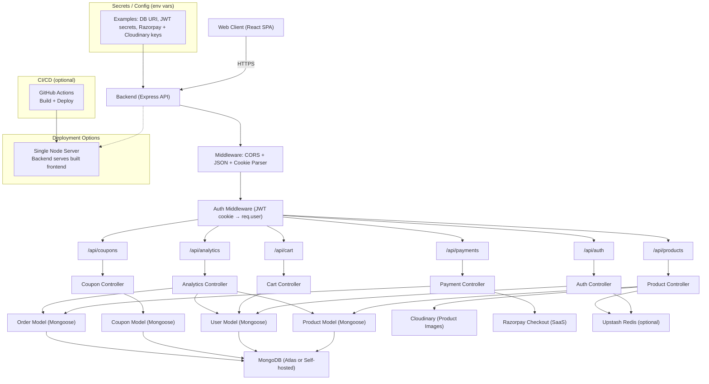

# Eastside

A full-stack ecommerce app where users can browse products, manage a cart, apply coupons, and pay with Razorpay, with an admin dashboard for product management and sales analytics.

**Tech stack**
- Frontend: React + Vite, Tailwind CSS, React Router, Zustand, Axios, Framer Motion
- Backend: Node.js + Express, MongoDB (Mongoose), JWT auth, Razorpay
- Services: Cloudinary (images), Upstash Redis (optional cache + refresh tokens), Razorpay Checkout

## Requirements
- Node.js 18+ (or newer LTS)
- MongoDB (local or Atlas)
- Razorpay account (Payments)
- Cloudinary account (images)
- Upstash Redis (optional, for cache + refresh tokens)

## Setup
1. Install dependencies
   - `npm install`
   - `npm install --prefix frontend`

2. Create backend environment file  
   Create `backend/.env` with:
   ```
   PORT=5001
   NODE_ENV=development
   MONGO_URI=your_mongodb_connection_string
   ACCESS_TOKEN_SECRET=your_access_token_secret
   REFRESH_TOKEN_SECRET=your_refresh_token_secret
   RAZORPAY_KEY_ID=your_razorpay_key_id
   RAZORPAY_KEY_SECRET=your_razorpay_key_secret
   CLIENT_URL=http://localhost:5173
   CLOUDINARY_CLOUD_NAME=your_cloudinary_cloud_name
   CLOUDINARY_API_KEY=your_cloudinary_api_key
   CLOUDINARY_API_SECRET=your_cloudinary_api_secret
   UPSTASH_REDIS_URL=your_upstash_redis_url
   ```

## Run locally (dev)
1. Start the backend
   - `npm run dev`

2. Start the frontend (in a new terminal)
   - `npm run dev --prefix frontend`

3. Open the app
   - `http://localhost:5173`

The backend runs on `http://localhost:5001`, and the frontend calls it at `http://localhost:5001/api` in development.

## Production build (single server)
This builds the frontend and serves it from the backend when `NODE_ENV=production`.

1. Build
   - `npm run build`

2. Start server
   - `npm start`

## Deployment
- Any Node hosting that supports environment variables and access to MongoDB
- Optional managed services: MongoDB Atlas, Cloudinary, Upstash Redis, Razorpay

## Architecture


## What you need to run this project
- A MongoDB connection string in `MONGO_URI`
- Razorpay credentials:
  - `RAZORPAY_KEY_ID`
  - `RAZORPAY_KEY_SECRET`
- Cloudinary credentials:
  - `CLOUDINARY_CLOUD_NAME`
  - `CLOUDINARY_API_KEY`
  - `CLOUDINARY_API_SECRET`
- JWT secrets:
  - `ACCESS_TOKEN_SECRET`
  - `REFRESH_TOKEN_SECRET`
- Optional Redis URL:
  - `UPSTASH_REDIS_URL`

## Notes
- CORS allows `CLIENT_URL` in development; if unset it falls back to `*`.
- In production, the backend serves the built frontend from `frontend/dist`.
- The backend loads env vars from `backend/.env` when starting from the repo root.
